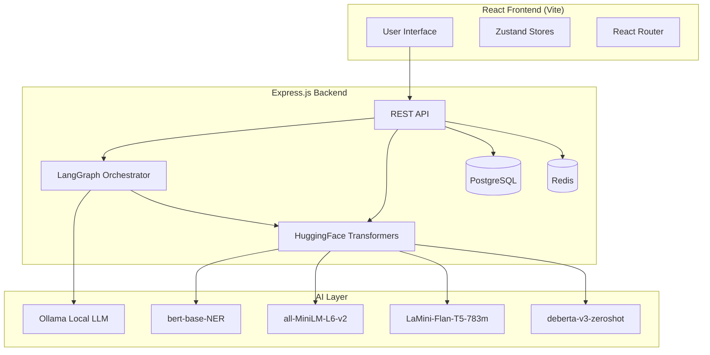
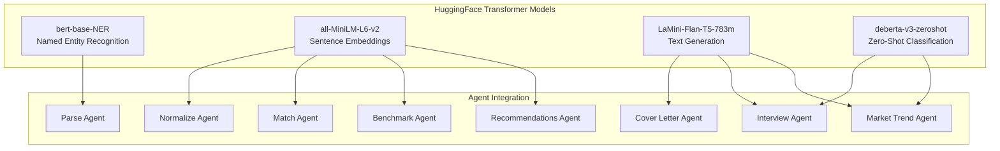
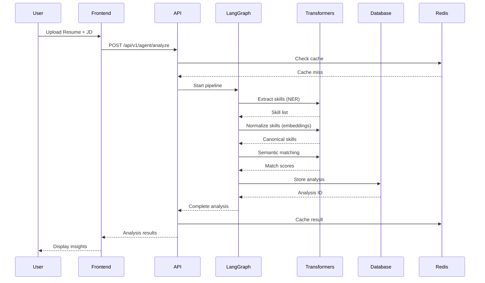
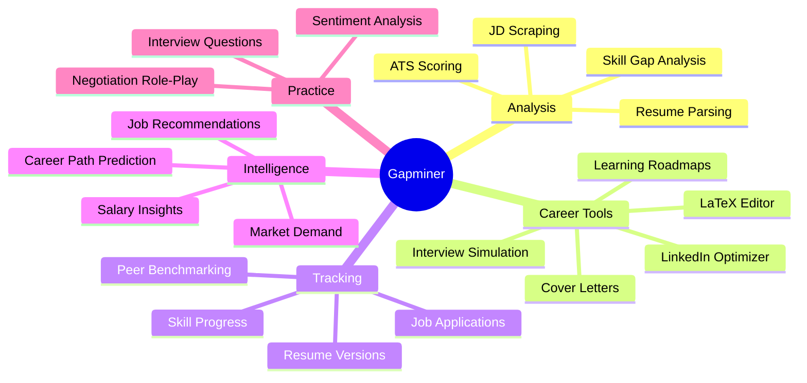
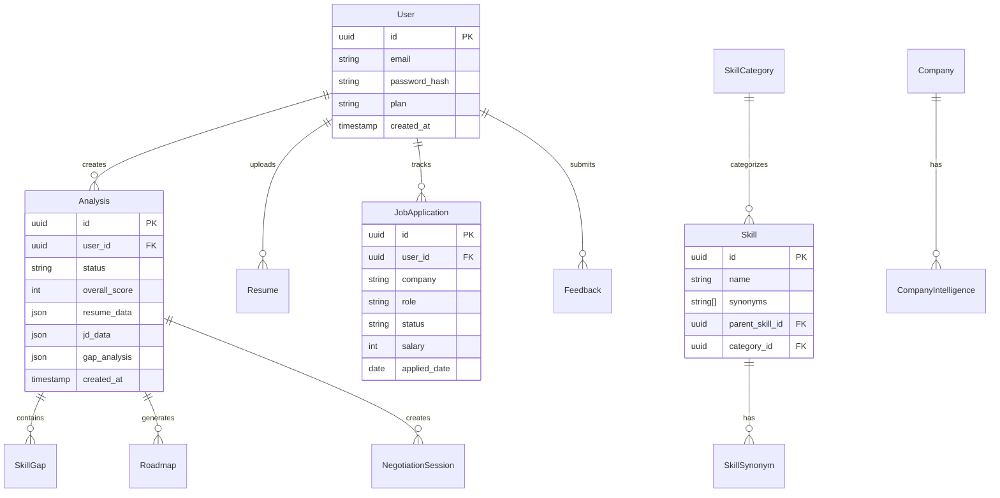
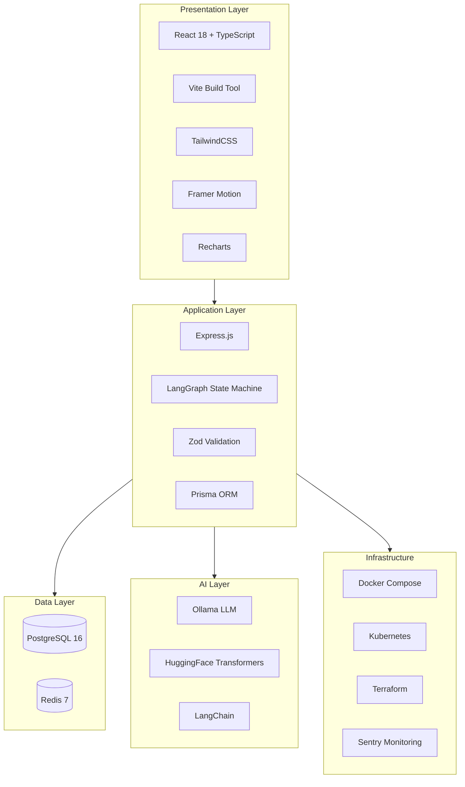

# Gapminer

## Precision AI Career Intelligence Platform

Gapminer is an AI-powered career development platform that helps professionals identify skill gaps, benchmark against job market requirements, and generate personalized learning roadmaps. It uses a **multi-agent AI orchestrator (LangGraph)** with **4 HuggingFace Transformer models** to analyze resumes and job descriptions, providing actionable insights in under 60 seconds.

---

## Features

### AI Engine

- **Multi-Agent Pipeline (LangGraph)**: 11 specialized AI agents working sequentially:
  1. **Parse Agent** - Extracts structured data using `bert-base-NER` for skill extraction
  2. **Normalize Agent** - Maps skills to canonical taxonomy using `all-MiniLM-L6-v2` embeddings
  3. **Match Agent** - Semantic skill matching with transformer-based relevance scoring
  4. **Market Intelligence Agent** - Salary insights and market demand data
  5. **Bench Strength Agent** - Candidate strength analysis
  6. **Interview Evaluation Agent** - Real-time interview scoring
  7. **Insights Agent** - Strategic career insights generation
  8. **ATS Optimization Agent** - Keyword matching and ATS scoring
  9. **Cover Letter Agent** - AI-generated tailored cover letters
  10. **Market Trend Agent** - Skill demand trend prediction
  11. **Skill Proficiency Agent** - Context-based skill level estimation

- **4 Transformer Models**:
  - `Xenova/bert-base-NER` - Named Entity Recognition for skill extraction
  - `Xenova/all-MiniLM-L6-v2` - Sentence embeddings for semantic similarity
  - `Xenova/LaMini-Flan-T5-783m` - Text generation for roadmaps and cover letters
  - `Xenova/deberta-v3-base-zeroshot` - Zero-shot classification for JD analysis

### Core Analysis Engine

- **Resume Analysis**: Upload PDF/DOCX/TXT or paste text for instant analysis
- **Job Description Scraping**: Paste LinkedIn, Indeed, or company career page URLs
- **Skill Gap Visualization**: Radar charts showing competency coverage across domains
- **Semantic Matching**: Transformer-based skill similarity scoring
- **ATS Optimization**: Keyword matching and scoring
- **Skill Proficiency Estimation**: Context-aware skill level assessment (Beginner/Intermediate/Advanced/Expert)

### Career Tools

- **Personalized Roadmaps**: Week-by-week learning plans with curated resources
- **LaTeX Resume Editor**: AI-assisted professional resume builder with live preview
- **Interview Simulation**: Practice technical interviews with AI feedback and transcription
- **Negotiation Companion**: Salary benchmarks and negotiation strategies
- **Cover Letter Generator**: AI-generated tailored cover letters with tone selection
- **Recruiter Dashboard**: Enterprise talent intelligence and candidate ranking

### Job Application Tracker

- **Kanban Board**: Visual pipeline with 7 stages (Saved → Applied → Screening → Interview → Offer → Accepted/Rejected)
- **Stats Dashboard**: Total applications, interview rate, offer rate
- **Search & Filter**: Find applications by company or role
- **Quick Status Updates**: Drag-and-drop status changes

### Skill Progress Dashboard

- **Score Progression Charts**: Track overall score improvement over time
- **Gap Closure Tracking**: Monitor skill gap reduction across analyses
- **Mastered Skills**: Identify consistently present skills
- **Hot & Emerging Skills**: Market-driven skill demand analysis

### LinkedIn Profile Optimizer

- **Headline Generation**: Optimized 220-character headlines
- **About Section**: Compelling professional summaries
- **Experience Bullets**: XYZ formula-optimized bullet points
- **Skill Recommendations**: Top 10 skills to highlight
- **Actionable Tips**: General LinkedIn optimization recommendations

### Resume Version Control

- **Version History**: Track all resume iterations
- **Semantic Diff**: AI-powered comparison showing added/removed content
- **Similarity Scoring**: Percentage similarity between versions
- **Restore**: Revert to any previous version

### Peer Benchmarking

- **Percentile Rankings**: See how you compare against peers
- **Score Comparison**: Your score vs. peer average
- **Skill Advantage Analysis**: Skills you have that peers don't
- **Skill Similarity**: Embedding-based skill relationship mapping

### Salary Negotiation Role-Play

- **Interactive Practice**: Multi-turn negotiation with AI recruiter
- **Realistic Scenarios**: Configurable company, role, and offer details
- **Performance Scorecard**: Post-session evaluation (Preparation, Communication, Strategy, Outcome)
- **Session History**: Track negotiation progress

### Job Recommendation Engine

- **Semantic Matching**: AI-powered job-to-profile matching
- **Match Scoring**: Percentage-based compatibility scores
- **Skill Gap Analysis**: Shared vs. missing skills per job
- **Filter by Match Level**: High (70%+), Medium (50-69%), Low (<50%)

### Market Demand Dashboard

- **Real-Time Skill Demand**: Live demand scores across tech skills
- **Hot Skills**: Top in-demand skills right now
- **Emerging Technologies**: Growing demand indicators
- **Declining Technologies**: Decreasing demand alerts
- **Demand Charts**: Bar charts and progress visualizations

### Career Path Predictor

- **Trajectory Analysis**: Predicted next career roles with probabilities
- **Timeline Estimates**: Expected time to reach each role
- **Skill Gap Identification**: Skills needed for target roles
- **Radar Charts**: Visual role probability comparison

### Transformer API Suite

- **`POST /transformers/classify-jd`** - Classify JD by category, seniority, work arrangement
- **`POST /transformers/analyze-sentiment`** - Analyze resume/cover letter sentiment
- **`POST /transformers/generate-questions`** - Generate interview questions by skill/difficulty
- **`POST /transformers/extract-skills`** - Extract skills from any text
- **`POST /transformers/market-trends`** - Predict market demand for skills

### Privacy-First Architecture

- All AI processing runs via local Ollama instances + HuggingFace Transformers
- 100% encrypted data transmission
- Auto-deletion of resumes after 30 days
- Rate limiting (100 req/15min global, 20 req/15min auth)
- Sentry error monitoring

---

## Tech Stack

| Layer                | Technology                                     |
| -------------------- | ---------------------------------------------- |
| **Frontend**         | React 18, TypeScript, Vite, TailwindCSS        |
| **State Management** | Zustand, React Query                           |
| **UI Components**    | Framer Motion, Recharts, Lucide Icons          |
| **Backend API**      | Express.js, TypeScript, Prisma ORM             |
| **Database**         | PostgreSQL 16                                  |
| **Caching**          | Redis 7                                        |
| **AI Engine**        | LangGraph, LangChain, Ollama (local LLM)       |
| **Transformers**     | @huggingface/transformers (4 quantized models) |
| **Infrastructure**   | Docker, Kubernetes, Terraform                  |
| **Monitoring**       | Sentry, Morgan logging                         |

---

## Project Structure

```text
gapminer/
├── apps/
│   ├── web/                 # React frontend application
│   │   ├── src/
│   │   │   ├── pages/       # 17 page components
│   │   │   │   ├── LandingPage.tsx
│   │   │   │   ├── AuthPage.tsx
│   │   │   │   ├── Dashboard.tsx
│   │   │   │   ├── AnalyzerPage.tsx
│   │   │   │   ├── RoadmapPage.tsx
│   │   │   │   ├── ProfilePage.tsx
│   │   │   │   ├── PricingPage.tsx
│   │   │   │   ├── LatexEditorPage.tsx
│   │   │   │   ├── InterviewSimulationPage.tsx
│   │   │   │   ├── RecruiterDashboardPage.tsx
│   │   │   │   ├── NegotiationCompanionPage.tsx
│   │   │   │   ├── CoverLetterPage.tsx          # NEW
│   │   │   │   ├── JobTrackerPage.tsx            # NEW
│   │   │   │   ├── SkillProgressPage.tsx         # NEW
│   │   │   │   ├── LinkedInOptimizerPage.tsx     # NEW
│   │   │   │   ├── ResumeVersionsPage.tsx        # NEW
│   │   │   │   ├── BenchmarkPage.tsx             # NEW
│   │   │   │   ├── NegotiationRoleplayPage.tsx   # NEW
│   │   │   │   ├── RecommendationsPage.tsx       # NEW
│   │   │   │   ├── MarketDemandPage.tsx          # NEW
│   │   │   │   └── CareerPathPage.tsx            # NEW
│   │   │   ├── stores/      # Zustand state stores
│   │   │   ├── lib/         # Utilities (authFetch, etc.)
│   │   │   └── main.tsx     # App entry point
│   │   ├── package.json
│   │   └── vite.config.ts
│   │
│   └── api/                 # Backend API
│       ├── src/
│       │   ├── ai/          # LangGraph multi-agent pipeline
│       │   │   ├── orchestrator.ts   # Master workflow (11 agents)
│       │   │   ├── model.ts          # LLM configuration
│       │   │   ├── state.ts          # Graph state annotation
│       │   │   ├── schemas.ts        # Zod schemas
│       │   │   └── agents/           # 11 agent implementations
│       │   │       ├── parse.ts
│       │   │       ├── normalize.ts
│       │   │       ├── match.ts
│       │   │       ├── market.ts
│       │   │       ├── bench.ts
│       │   │       ├── eval.ts
│       │   │       ├── insights.ts
│       │   │       ├── ats.ts
│       │   │       ├── coverLetter.ts       # NEW
│       │   │       ├── marketTrend.ts       # NEW
│       │   │       └── skillProficiency.ts  # NEW
│       │   ├── api/v1/      # REST endpoints (20+ routes)
│       │   │   ├── endpoints/
│       │   │   │   ├── auth.js
│       │   │   │   ├── analysis.js
│       │   │   │   ├── resume.ts
│       │   │   │   ├── jd.js
│       │   │   │   ├── roadmap.js
│       │   │   │   ├── user.js
│       │   │   │   ├── agent.ts
│       │   │   │   ├── parse.ts
│       │   │   │   ├── scrape.ts
│       │   │   │   ├── interview.ts
│       │   │   │   ├── latex.ts
│       │   │   │   ├── negotiation.ts
│       │   │   │   ├── chat.ts
│       │   │   │   ├── recruiter.ts
│       │   │   │   ├── feedback.js          # NEW
│       │   │   │   ├── coverLetter.js       # NEW
│       │   │   │   ├── jobTracker.js        # NEW
│       │   │   │   ├── progress.js          # NEW
│       │   │   │   ├── linkedin.js          # NEW
│       │   │   │   ├── resumeVersions.js    # NEW
│       │   │   │   ├── benchmark.js         # NEW
│       │   │   │   ├── negotiationRoleplay.js # NEW
│       │   │   │   ├── recommendations.js   # NEW
│       │   │   │   ├── transformers.js      # NEW
│       │   │   │   ├── payments.js
│       │   │   │   ├── skillsTrend.js
│       │   │   │   └── ...
│       │   │   └── router.js
│       │   ├── core/        # Configuration and utilities
│       │   │   ├── config.js
│       │   │   ├── database.js
│       │   │   └── security.js
│       │   ├── services/    # Business logic
│       │   │   ├── transformerModels.js  # NEW - 4 models, 12 functions
│       │   │   ├── ai_pipeline.js
│       │   │   ├── scraper.ts
│       │   │   ├── documentParser.ts
│       │   │   └── websocket.js
│       │   ├── docs/        # Swagger documentation
│       │   └── index.js     # Express entry point
│       ├── prisma/          # Database schema
│       └── package.json
│
├── packages/
│   └── types/               # Shared TypeScript type definitions
│
├── infra/
│   ├── docker-compose.yml   # Local development environment
│   ├── k8s/                 # Kubernetes manifests
│   └── terraform/           # Cloud infrastructure (Azure)
│
├── package.json             # Root workspace config
├── turbo.json               # Turborepo configuration
└── README.md
```

---

## Getting Started

### Prerequisites

- Node.js >= 20.0.0
- npm >= 10.0.0
- Docker & Docker Compose
- 4GB+ available RAM (for Ollama + Transformers)

### Quick Start

1. **Clone and install dependencies**

   ```bash
   cd gapminer
   npm install
   ```

2. **Start the development environment**

   ```bash
   cd infra && docker-compose up -d
   ```

3. **Run the application**

   ```bash
   # Development mode with hot reload
   npm run dev

   # Or run specific apps
   npm run web     # Frontend only (port 5173)
   npm run api     # Backend only (port 8000)
   ```

4. **Access the application**
   - Frontend: <http://localhost:5173>
   - API: <http://localhost:8000>
   - API Docs: <http://localhost:8000/docs>
   - Health Check: <http://localhost:8000/health>

### Available Scripts

| Command         | Description                            |
| --------------- | -------------------------------------- |
| `npm run dev`   | Start all apps in development mode     |
| `npm run build` | Build all apps for production          |
| `npm run lint`  | Run linting across all packages        |
| `npm run test`  | Run tests                              |
| `npm run clean` | Clean build artifacts and node_modules |

---

## API Endpoints

### Authentication

- `POST /api/v1/auth/register` - Register new user
- `POST /api/v1/auth/login` - Login and get JWT token

### Analysis

- `POST /api/v1/agent/analyze` - Start resume/job analysis
- `GET /api/v1/analysis` - List user's analyses
- `GET /api/v1/analysis/:id` - Get analysis details

### Resume

- `POST /api/v1/agent/parse` - Parse resume document
- `GET /api/v1/resumes` - List user's resumes
- `POST /api/v1/resumes` - Upload new resume
- `PUT /api/v1/resume/:id` - Update resume

### Job Descriptions

- `POST /api/v1/agent/scrape` - Scrape job description from URL
- `GET /api/v1/jobs` - List saved job descriptions

### Roadmaps

- `GET /api/v1/roadmaps/:id` - Get roadmap details
- `PUT /api/v1/roadmaps/:id/progress` - Update milestone status

### Cover Letters

- `POST /api/v1/cover-letter` - Generate AI cover letter

### Job Application Tracker

- `POST /api/v1/jobs` - Create job application
- `GET /api/v1/jobs` - List all applications
- `GET /api/v1/jobs/:id` - Get single application
- `PUT /api/v1/jobs/:id` - Update application
- `DELETE /api/v1/jobs/:id` - Delete application
- `GET /api/v1/jobs/stats` - Get application statistics

### Skill Progress

- `GET /api/v1/progress/:userId` - Get skill progression data
- `GET /api/v1/progress/compare/:userId/:id1/:id2` - Compare two analyses

### LinkedIn Optimizer

- `POST /api/v1/linkedin/optimize` - Generate optimized LinkedIn content

### Resume Version Control

- `POST /api/v1/resume-versions/:id/version` - Create new version
- `GET /api/v1/resume-versions/:id/versions` - List all versions
- `POST /api/v1/resume-versions/diff` - Compare two versions
- `POST /api/v1/resume-versions/:id/restore` - Restore previous version

### Peer Benchmarking

- `GET /api/v1/benchmark/compare` - Compare against peers
- `POST /api/v1/benchmark/skill-similarity` - Compare two skills

### Salary Negotiation Role-Play

- `POST /api/v1/negotiation-roleplay/start` - Start negotiation session
- `POST /api/v1/negotiation-roleplay/respond` - Send response
- `GET /api/v1/negotiation-roleplay/score/:sessionId` - Get scorecard

### Job Recommendations

- `POST /api/v1/recommendations/recommend` - Get personalized job recommendations

### Transformer Utilities

- `POST /api/v1/transformers/classify-jd` - Classify job description
- `POST /api/v1/transformers/analyze-sentiment` - Analyze text sentiment
- `POST /api/v1/transformers/generate-questions` - Generate interview questions
- `POST /api/v1/transformers/extract-skills` - Extract skills from text
- `POST /api/v1/transformers/market-trends` - Predict skill market trends

### Interview Simulation

- `POST /api/v1/interview/next-question` - Get next interview question
- `POST /api/v1/interview/transcribe` - Transcribe audio response

### Feedback

- `POST /api/v1/feedback/:analysisId` - Submit feedback
- `GET /api/v1/feedback/:analysisId` - Get feedback for analysis

### Health

- `GET /health` - API health check

---

## Frontend Routes

| Route                   | Page                     | Description                      |
| ----------------------- | ------------------------ | -------------------------------- |
| `/`                     | LandingPage              | Public landing page              |
| `/auth`                 | AuthPage                 | Login/Register                   |
| `/pricing`              | PricingPage              | Subscription plans               |
| `/dashboard`            | Dashboard                | User dashboard                   |
| `/analyze`              | AnalyzerPage             | Resume/JD analysis               |
| `/latex/:id?`           | LatexEditorPage          | LaTeX resume editor              |
| `/roadmap/:id`          | RoadmapPage              | Learning roadmap                 |
| `/profile`              | ProfilePage              | User profile                     |
| `/interview`            | InterviewSimulationPage  | AI interview practice            |
| `/recruiter`            | RecruiterDashboardPage   | Recruiter talent dashboard       |
| `/negotiate`            | NegotiationCompanionPage | Salary negotiation strategies    |
| `/cover-letter`         | CoverLetterPage          | AI cover letter generator        |
| `/jobs`                 | JobTrackerPage           | Job application tracker          |
| `/progress`             | SkillProgressPage        | Skill progress dashboard         |
| `/linkedin`             | LinkedInOptimizerPage    | LinkedIn profile optimizer       |
| `/resume-versions`      | ResumeVersionsPage       | Resume version control           |
| `/benchmark`            | BenchmarkPage            | Peer benchmarking                |
| `/negotiation-roleplay` | NegotiationRoleplayPage  | Interactive negotiation practice |
| `/recommendations`      | RecommendationsPage      | AI job recommendations           |
| `/market-demand`        | MarketDemandPage         | Real-time skill demand dashboard |
| `/career-path`          | CareerPathPage           | Career trajectory predictor      |

---

## Pricing Plans

| Plan      | Price  | Features                                              |
| --------- | ------ | ----------------------------------------------------- |
| **Free**  | $0/mo  | 1 analysis/month, basic radar chart                   |
| **Pro**   | $12/mo | Unlimited analysis, ATS optimizer, verified resources |
| **Teams** | $49/mo | Up to 10 members, market intelligence dashboard       |

---

## Architecture

### System Overview



### Multi-Agent Pipeline Flow (LangGraph)

```mermaid
flowchart LR
    START([START]) --> parse

    subgraph Analysis["Analysis Pipeline"]
        parse[Parse Agent<br/>Skill Extraction]
        normalize[Normalize Agent<br/>Skill Canonicalization]
        match[Match Agent<br/>Semantic Matching]
        market[Market Agent<br/>Salary & Demand]
        bench[Bench Agent<br/>Strength Analysis]
        eval[Eval Agent<br/>Interview Scoring]
        insights[Insights Agent<br/>Career Insights]
        ats[ATS Agent<br/>Optimization Score]
    end

    subgraph Generation["Generation Pipeline"]
        coverLetter[Cover Letter Agent<br/>Tailored Letters]
        marketTrend[Market Trend Agent<br/>Demand Prediction]
        skillProf[Skill Proficiency Agent<br/>Level Estimation]
    end

    parse --> normalize
    normalize --> match
    match --> market
    market --> bench
    bench --> eval
    eval --> insights
    insights --> ats
    ats --> coverLetter
    coverLetter --> marketTrend
    marketTrend --> skillProf
    skillProf --> END([END])

    style START fill:#10b981,color:#fff
    style END fill:#ef4444,color:#fff
    style parse fill:#3b82f6,color:#fff
    style normalize fill:#3b82f6,color:#fff
    style match fill:#3b82f6,color:#fff
    style market fill:#3b82f6,color:#fff
    style bench fill:#3b82f6,color:#fff
    style eval fill:#3b82f6,color:#fff
    style insights fill:#3b82f6,color:#fff
    style ats fill:#3b82f6,color:#fff
    style coverLetter fill:#8b5cf6,color:#fff
    style marketTrend fill:#8b5cf6,color:#fff
    style skillProf fill:#8b5cf6,color:#fff
```



### Transformer Model Integration



### Data Flow Architecture



### Feature Module Map



### Database Schema Overview



### Tech Stack Layers



### Data Privacy

- All AI inference runs on local Ollama instances (no data leaves your infrastructure)
- Transformer models are quantized and run locally via @huggingface/transformers
- PostgreSQL stores user data with encrypted passwords
- Redis caches session data with configurable TTL
- Resume files are auto-deleted after 30 days (configurable)
- Rate limiting protects against abuse (100 req/15min global, 20 req/15min auth)
- Sentry error monitoring for production reliability

---

## Deployment

### Production Deployment (Azure)

```bash
# Infrastructure setup
cd infra/terraform
terraform init
terraform plan -var="environment=prod"
terraform apply

# Build and deploy
docker-compose -f docker-compose.prod.yml build
docker-compose -f docker-compose.prod.yml push
```

### Kubernetes Deployment

```bash
kubectl apply -f infra/k8s/
```

---

## Contributing

1. Fork the repository
2. Create a feature branch (`git checkout -b feature/amazing-feature`)
3. Commit changes (`git commit -m 'Add amazing feature'`)
4. Push to branch (`git push origin feature/amazing-feature`)
5. Open a Pull Request

---

## License

This project is proprietary software. All rights reserved.

---

## Support

- Documentation: <https://docs.gapminer.ai>
- Issues: <https://github.com/gapminer/issues>
- Email: <support@gapminer.ai>
